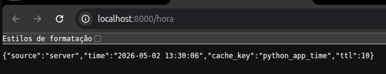
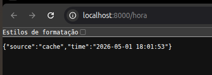
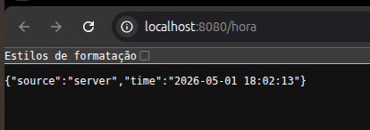
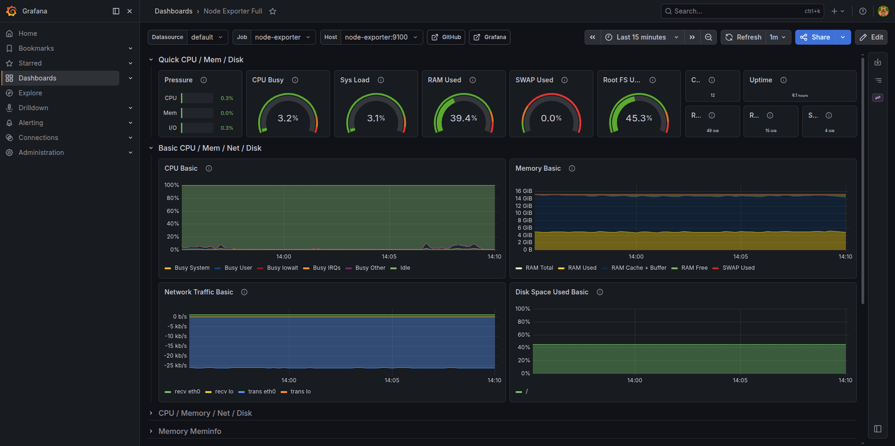
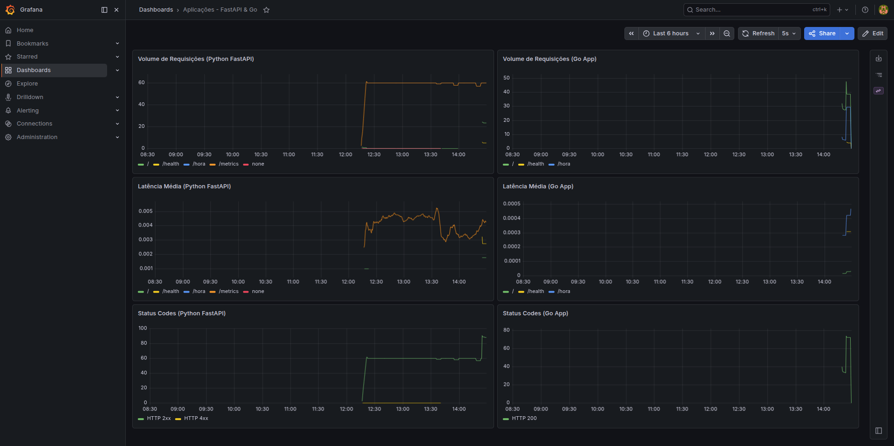

# Desafio Técnico DevOps

Este repositório contém a resolução completa do desafio, contemplando duas aplicações (Python/Go), sistema de cache (Redis), observabilidade (Prometheus + Grafana + Node Exporter) e integração contínua via GitHub Actions.

## Documentação do Projeto

O planejamento inicial, a arquitetura escolhida, o diagrama e os pontos de melhoria estão separados nos seguintes documentos:
- [**Desafio proposto**](docs/desafio.md)
- [**Planejamento**](docs/planejamento.md)
- [**Diagrama da Solução e Pontos de Melhoria**](docs/diagrama.md)

## Como executar localmente

Para facilitar a execução, as imagens Docker de ambas as aplicações são geradas automaticamente na pipeline de CI e armazenadas no **GitHub Container Registry (GHCR)**. Sendo assim, você não precisa "buildar" as imagens localmente, economizando tempo e recursos da sua máquina.

### Pré-requisitos
- Docker e Docker Compose instalados.

### Passos
1. Clone este repositório:
```bash
git clone https://github.com/marcustkd1/desafio-devops-engineer.git
cd desafio-devops-engineer
```

2. Suba a infraestrutura completa:
```bash
docker compose up -d
```
> O Docker fará o pull das imagens mais recentes diretamente do GHCR e subirá todos os serviços.

### Componentes da stack

| Serviço | URL de Acesso Local | Descrição |
| --- | --- | --- |
| **App Python** | [http://localhost:8000](http://localhost:8000) | API em FastAPI (Cache de 10s). Rotas: [Texto](http://localhost:8000/), [Hora](http://localhost:8000/hora), [Health](http://localhost:8000/health), [Métricas](http://localhost:8000/metrics) |
| **App Go** | [http://localhost:8080](http://localhost:8080) | API em Go nativo (Cache de 60s). Rotas: [Texto](http://localhost:8080/), [Hora](http://localhost:8080/hora), [Health](http://localhost:8080/health), [Métricas](http://localhost:8080/metrics) |
| **Grafana** | [http://localhost:3000](http://localhost:3000) | Painel de visualização de métricas (Login/Senha Padrão: `admin`). |
| **Prometheus**| [http://localhost:9090](http://localhost:9090) | Interface principal do coletor de métricas. |
| **Node Exporter** | [http://localhost:9100](http://localhost:9100) | Coletor de métricas da infraestrutura (CPU, RAM, Disco). |
| **Redis** | `localhost:6379` | Banco de dados em memória atuando como cache (Acesso via CLI ou Client, sem interface web). |

---

### Cache Redis - Implementação e Evidências

A camada de cache foi implementada utilizando o **Redis**. A rota `/hora` nas duas aplicações foi construída propositalmente para provar a eficiência e o controle de tempo do cache (TTL - *Time to Live*).

O JSON retornado possui a chave `"source"`, indicando se o dado foi processado pela aplicação (`"server"`) ou devolvido da memória (`"cache"`).

#### Teste na App Python (TTL: 10 Segundos)
A configuração de cache no Python está localizada no arquivo `python-app/main.py`:
```python
redis_client.setex("python_app_time", 10, current_time) # 10 segundos de TTL
```
- **Primeiro acesso:** A aplicação processa a hora e retorna `"source": "server"`.
- **Acessos sequenciais (dentro de 10s):** A hora é congelada e o Redis devolve o valor em memória `"source": "cache"`.

| Processamento (Server) | Retorno em Memória (Cache) |
| :---: | :---: |
|  |  |

#### Teste na App Go (TTL: 60 Segundos)
A configuração de cache no Go está localizada no arquivo `go-app/main.go`:
```go
redisClient.Set(ctx, cacheKey, currentTime, 1*time.Minute) // 60 segundos de TTL
```
- O comportamento é o mesmo, mas a retenção de memória na rota Go foi estipulada para durar **1 minuto**.

| Processamento (Server) | Retorno em Memória (Cache) |
| :---: | :---: |
|  |  |

---

### Observabilidade - Implementação e Evidências

A stack de observabilidade conta com o **Prometheus** (coletando métricas) e o **Grafana** para exposição e visualização (a stack será provisionada de forma 100% automatizada, incluindo dashboards pré configurados). Seguem abaixo as evidencias dos dashboards em funcionamento:

#### Visão da Infraestrutura e Servidor (Node Exporter)
Métricas detalhadas da máquina hospedeira (CPU, Memória, Disco e Rede) vitais para Operations:


#### Visão das métricas das Aplicações
Métricas focadas no comportamento dos apps, extraídas via middlewares customizados:
- **Volume de Requisições:** Total absoluto de chamadas em cada rota.
- **Latência Média:** Tempo em segundos do processamento interno.
- **Status Codes:** Contabilização de requisições por código HTTP (`2xx`, `4xx`, `5xx`).

