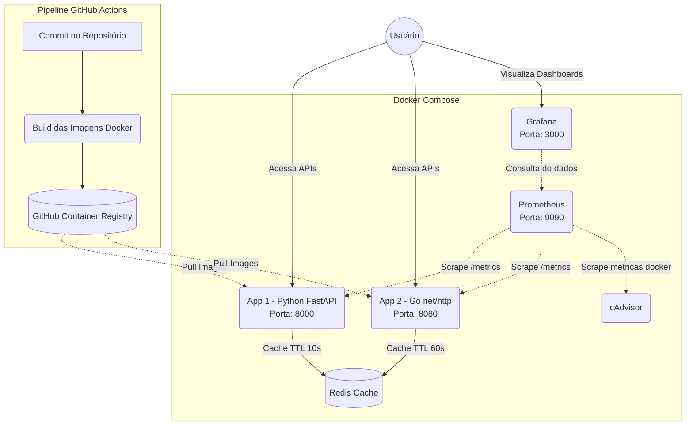

# Arquitetura da Solução

O diagrama a seguir descreve a topologia da infraestrutura proposta e o fluxo da integração contínua. 
Pode ser visualizado nativamente no GitHub ou colado em ferramentas compatíveis com Mermaid (ex: Miro, Notion).

