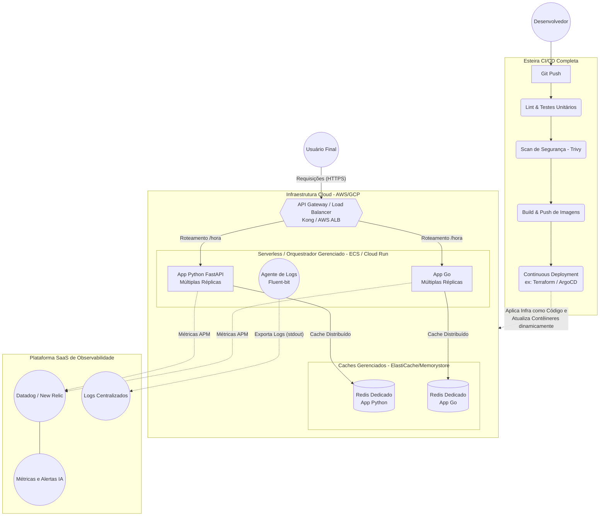

# Arquitetura da Solução

O diagrama a seguir descreve a topologia da infraestrutura proposta e o fluxo da integração contínua e atualização. 
Pode ser visualizado nativamente no GitHub ou colado em ferramentas compatíveis com Mermaid (ex: Miro, Notion).

```mermaid
flowchart TD
    %% Atores
    User((Usuário Final))
    Dev((Desenvolvedor/DevOps))

    subgraph Atualização de Código (CI) [GitHub Actions]
        CodePush[Git Push (App Go/Python)] --> BuildImages(Build Docker)
        BuildImages --> PushGHCR[(GitHub Container Registry)]
    end

    subgraph Atualização de Infraestrutura (CD Local)
        InfraUpdate[Git Push / Alteração Local (YAMLs)] --> DockerReload(docker compose up -d)
        PushGHCR -. "docker compose pull" .-> DockerReload
    end

    subgraph Infraestrutura Local [Docker Compose / Servidor]
        %% Aplicações
        AppPython(App 1 - Python FastAPI\nPorta: 8000)
        AppGo(App 2 - Go net/http\nPorta: 8080)
        
        %% Componentes auxiliares
        Redis[(Redis Cache)]
        
        %% Observabilidade
        Prometheus(Prometheus\nPorta: 9090)
        NodeExporter(Node Exporter\nPorta: 9100)
        Grafana(Grafana\nPorta: 3000)
    end

    %% Fluxos de Atualização (Deploy)
    DockerReload ==> |"Recria container se imagem atualizou"| AppPython
    DockerReload ==> |"Recria container se imagem atualizou"| AppGo
    DockerReload ==> |"Aplica novas configurações/versões"| Redis
    DockerReload ==> |"Aplica novas configurações/versões"| Prometheus
    DockerReload ==> |"Aplica novas configurações/versões"| Grafana
    DockerReload ==> |"Aplica novas configurações/versões"| NodeExporter

    %% Tráfego do Usuário
    User -- "Acessa APIs" --> AppPython
    User -- "Acessa APIs" --> AppGo
    User -- "Visualiza Dashboards" --> Grafana
    
    %% Tráfego Interno e Cache
    AppPython -- "Cache TTL 10s" --> Redis
    AppGo -- "Cache TTL 60s" --> Redis
    
    %% Observabilidade
    Prometheus -. "Scrape /metrics" .-> AppPython
    Prometheus -. "Scrape /metrics" .-> AppGo
    Prometheus -. "Scrape /metrics" .-> NodeExporter
    Grafana -. "Consulta de dados" .-> Prometheus

    %% Interação do Dev
    Dev --> CodePush
    Dev --> InfraUpdate
```

---

## Análise e Sugestões de Melhorias na Arquitetura (Visão de Futuro)

O diagrama abaixo representa como a arquitetura atual evoluiria para um ambiente de produção robusto, aplicando todas as melhorias levantadas:



Embora a solução original implementada seja eficiente para testes e ambientes locais (visando cumprir o "Básico bem feito"), a transição para a arquitetura ilustrada acima resolve os seguintes gargalos:

### 1. Segregação de Instâncias do Redis
- **Diagnóstico:** As duas APIs compartilham o mesmo banco de cache local, o que pode causar colisão de chaves e falhas em cascata (se uma API derrubar o Redis por volume, afeta a outra).
- **Melhoria:** Separar o Redis em instâncias dedicadas. Para nuvem, adotar serviços gerenciados (ex: Memorystore no GCP ou ElastiCache na AWS).

### 2. Orquestração e Escalabilidade (Serviços Gerenciados)
- **Diagnóstico:** O Docker Compose rodando em uma máquina única não possui escalabilidade horizontal automática nem alta disponibilidade.
- **Melhoria:** Migrar para serviços serverless ou orquestradores gerenciados como ECS com Fargate (AWS) ou Cloud Run (GCP). Isso removes o custo operacional de gerir o host e permite escalar de zero a *N* instâncias dinamicamente. (Kubernetes puro seria "over-engineering" para apenas duas rotas).

### 3. API Gateway / Ingress Controller
- **Diagnóstico:** As portas das aplicações (8000 e 8080) ficam diretamente expostas para a internet/usuário.
- **Melhoria:** Implementar um API Gateway (ex: Kong) ou proxy reverso (Nginx) na borda. Isso centraliza a terminação SSL/TLS, roteamento e rate-limiting em um ponto único e seguro.

### 4. Evolução da Observabilidade (SaaS)
- **Diagnóstico:** A stack Prometheus/Grafana consome recursos computacionais do próprio host e requer manutenção/armazenamento contínuos para manter retenção de histórico longo, exigindo gestão de discos locais.
- **Melhoria:** Utilizar soluções SaaS robustas de mercado (Datadog, New Relic), que terceirizam o armazenamento, simplificam a visualização e possuem alertas avançados via Inteligência Artificial e gestão de acessos nativa.

### 5. Gestão Centralizada de Logs
- **Diagnóstico:** Hoje os logs morrem no `stdout/stderr` do container, perdendo seu histórico ao serem recriados (como num `down` ou atualização).
- **Melhoria:** Exportar ativamente os logs das aplicações (ex: usando agentes como Fluent-bit) para centralizadores analíticos (como Datadog, ELK Stack, ou Loki) facilitando investigações e troubleshoot.

### 6. Pipeline de CI/CD Completa
- **Diagnóstico:** A Pipeline hoje realiza apenas a etapa de CI (Build/Push das Imagens). A etapa de atualização na máquina (CD) demanda um comando manual (`docker compose pull && docker compose up -d`).
- **Melhoria:** Adicionar Linters de código, qualidade e segurança (ex: Trivy) na etapa de CI. Para o CD, criar um fluxo 100% automatizado, com deploy automático via GitOps (ArgoCD se kubernetes) ou rotinas via Terraform aplicando diretamente nos provedores Cloud.
